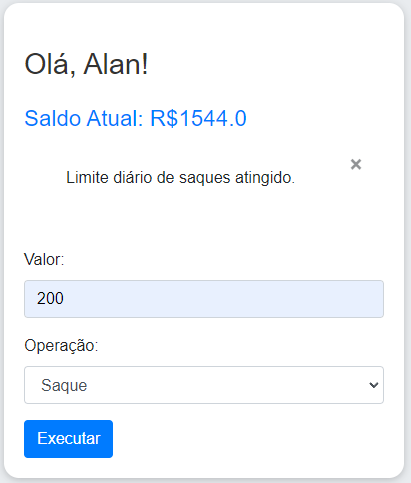

# Sistema Bancário em Flask

Este projeto é um sistema bancário simples desenvolvido com Flask. Ele permite aos usuários criar uma conta, realizar depósitos e saques, e exibe informações sobre a conta, como saldo e limites de saque.

Abaixo está uma captura de tela da aplicação:



## Funcionalidades

- **Cadastro de Usuário:** Os usuários podem inserir seu nome para criar uma conta.
- **Operações Bancárias:** Os usuários podem realizar depósitos e saques.
- **Limite de Saque:** O sistema permite um máximo de 3 saques diários, com um limite de R$ 500 por saque.
- **Gerador de Conta:** Após o login, um número de agência e conta é gerado aleatoriamente para o usuário.

## Tecnologias Utilizadas

- Flask
- HTML/CSS para o frontend
- Bootstrap para a estilização

## Pré-requisitos

Certifique-se de ter o Python 3.6 ou superior instalado em seu sistema. Além disso, é necessário ter o Flask instalado. Você pode instalar as dependências do projeto listadas no `requirements.txt` com o seguinte comando:

```bash
pip install -r requirements.txt
```

## Configuração e Execução
1. Clone o Repositório:

```bash
Copiar código
git clone https://github.com/seu-usuario/seu-repositorio.git
cd seu-repositorio
```

2. Instale as Dependências:

```bash
Copiar código
pip install -r requirements.txt
```

3. Execute a Aplicação:

```bash
python app.py
```

A aplicação estará disponível em http://127.0.0.1:5000/.

## Estrutura do Projeto
`app.py`: Arquivo principal da aplicação Flask, que contém as rotas e lógica do sistema bancário.
`templates/index.html`: Página inicial onde o usuário insere seu nome.
`templates/principal.html`: Página principal onde o usuário realiza operações bancárias.
`requirements.txt`: Lista de dependências do projeto.

## Contribuições
Contribuições são bem-vindas! Se você encontrar algum problema ou tiver sugestões para melhorias, sinta-se à vontade para abrir um issue ou enviar um pull request.

## Licença
Este projeto é licenciado sob a MIT License.

## Contato
Se você tiver alguma dúvida, entre em contato com alanzit0xz@gmail.com


